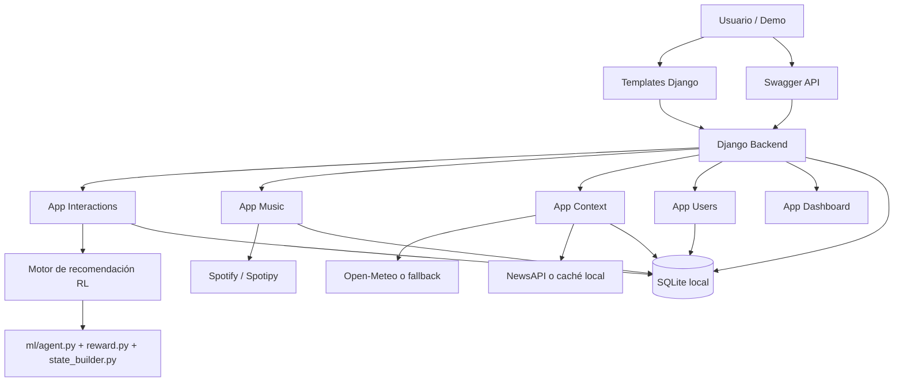

# MoodSic - Documento de entrega para Docs

## 1. Portada

**Nombre del proyecto:** MoodSic  
**Integrantes:** [Completar por el equipo]  
**Fecha:** 16/04/2026  
**Repositorio:** https://github.com/IJMadalenA/moodsic

---

## 2. Estado actual del producto

### Resumen general

MoodSic es un sistema de recomendación musical contextual construido sobre Django y Django Ninja. El proyecto combina historial del usuario, contexto meteorológico, noticias y una capa de aprendizaje por refuerzo para generar playlists personalizadas. Además, está preparado para trabajar tanto en modo online como en modo offline.

### Funcionalidades completas

- generación de playlists personalizadas;
- registro de interacciones del usuario y cálculo de reward;
- integración de contexto meteorológico y noticias;
- entrenamiento y evaluación del modelo de recomendación;
- benchmarking reproducible con configuración de pesos y sensibilidad;
- modo offline funcional para desarrollo, demos y validación;
- panel admin y demo ligera para revisión del proyecto;
- documentación de onboarding y entrega.

### Funcionalidades parciales o condicionadas

- integración real con Spotify preparada, pero pendiente de validación final con credenciales y cuenta premium válidas;
- NewsAPI soportada, aunque el proyecto puede caer en fallback local si no hay clave activa;
- la parte visual existe como demo y templates de Django, no como frontend independiente tipo SPA.

### Qué queda pendiente para Fase 3

- validar el flujo real extremo a extremo con Spotify;
- completar evidencias visuales finales con capturas;
- si el equipo lo desea, reforzar la presentación del frontend o añadir una interfaz más avanzada.

### Funcionamiento real del sistema actualmente verificado

A nivel práctico, el sistema ya puede demostrarse en local de forma coherente y estable en modo offline:

- el backend arranca correctamente con Django y expone la API en Swagger;
- la parte visual disponible para demo responde desde la portada y el dashboard;
- el flujo de generación de playlists se puede ejecutar, devolver respuesta y persistir datos en la base local;
- los datos de contexto pueden provenir de servicios externos o de mecanismos de fallback/caché local;
- el modelo de recomendación y su lógica de entrenamiento/evaluación están integrados en el proyecto.

Esto significa que el producto sí funciona realmente, aunque la validación final con Spotify en modo real siga dependiendo de una cuenta premium y credenciales externas.

---

## 3. Guía de ejecución local

### Requisitos previos

- Python 3.12 o superior;
- Git instalado;
- entorno virtual de Python;
- dependencias del proyecto instalables desde requirements.txt;
- opcionalmente, credenciales reales de Spotify y NewsAPI.

### Variables de entorno

Crear un archivo .env en la raíz del proyecto. Variables relevantes:

- SECRET_KEY
- DEBUG
- DEVELOPMENT_MODE
- ALLOWED_HOSTS
- SPOTIPY_CLIENT_ID
- SPOTIPY_CLIENT_SECRET
- SPOTIPY_REDIRECT_URI
- NEWSAPI_KEY
- NEWSAPI_BASE_URL
- RECOMMENDER_CONTEXT_WEIGHT
- RECOMMENDER_HISTORY_WEIGHT

Ejemplo orientativo:

```env
SECRET_KEY=replace-me
DEBUG=True
DEVELOPMENT_MODE=True
ALLOWED_HOSTS=127.0.0.1,localhost
SPOTIPY_CLIENT_ID=your_spotify_client_id
SPOTIPY_CLIENT_SECRET=your_spotify_client_secret
SPOTIPY_REDIRECT_URI=http://127.0.0.1:8000/callback
NEWSAPI_KEY=
NEWSAPI_BASE_URL=https://newsapi.org/v2/everything
RECOMMENDER_CONTEXT_WEIGHT=0.6
RECOMMENDER_HISTORY_WEIGHT=0.4
```

### Pasos exactos desde cero

```bash
git clone https://github.com/IJMadalenA/moodsic.git
cd moodsic
python -m venv .venv
.venv\Scripts\activate
pip install -r requirements.txt
copy .env.example .env
python manage.py migrate
python manage.py createsuperuser
python manage.py runserver
```

### Orden de arranque recomendado

1. crear y activar el entorno virtual;
2. instalar dependencias;
3. preparar el archivo .env;
4. ejecutar migraciones;
5. crear superusuario;
6. arrancar el servidor;
7. abrir el proyecto en navegador.

### URLs útiles

- Demo principal: http://127.0.0.1:8000/
- Dashboard: http://127.0.0.1:8000/dashboard/
- Admin: http://127.0.0.1:8000/admin/
- Swagger API: http://127.0.0.1:8000/api/interactions/docs/

### Flujo offline para pruebas o demo

```bash
python manage.py seed_synthetic_context
python manage.py seed_synthetic_interactions
python manage.py evaluate_model --with-synthetic-context --auto-train
```

---

## 4. Evidencias funcionales

> En este apartado se deben insertar capturas manualmente antes de la entrega final.

### Evidencia 1: Front funcionando

Insertar aquí captura de:
- portada del proyecto en la ruta principal;
- dashboard de demo.

### Evidencia 2: Backend activo

Insertar aquí captura de:
- Swagger en funcionamiento;
- panel de administración de Django.

### Evidencia 3: Flujo completo

Insertar aquí captura de:
- generación de playlist vía API;
- respuesta JSON con campos como mode, message y warnings;
- revisión en admin de las playlists e interacciones guardadas.

### Evidencias técnicas ya verificadas

- comprobación del proyecto con Django sin incidencias;
- batería relevante de tests de interacciones y generación de playlists en verde;
- rama offline-benchmarking publicada en remoto.

---

## 5. Arquitectura real implementada

### Diagrama actualizado



### Explicación

La arquitectura real implementada es la de una aplicación web Django con API construida con Django Ninja. La lógica principal vive en la capa de servicios, especialmente en la generación de playlists y el cálculo de reward. El sistema guarda datos en SQLite en desarrollo local y puede trabajar incluso sin APIs reales gracias a sus mecanismos de fallback y a los datos sintéticos.

No existe un frontend desacoplado tipo React o Vue; la parte visual actual se apoya en templates HTML de Django y en el panel de administración.

### Correspondencia entre arquitectura diseñada e implementada

La propuesta original del proyecto buscaba un sistema modular con backend, contexto, recomendación y capa de interacción con servicios musicales. La implementación final mantiene esa idea central:

- backend web y API claramente separados por aplicaciones de Django;
- módulo de recomendación con componentes específicos de estado, reward y agente RL;
- integración de datos externos mediante servicios dedicados;
- almacenamiento local y operativa reproducible para desarrollo y demo;
- capa visual suficiente para validar el flujo funcional aunque no se haya desarrollado un frontend desacoplado.

En consecuencia, la arquitectura implementada sí corresponde de forma clara con la arquitectura funcional planteada para el proyecto.

---

## 6. Índice de código real del proyecto

A continuación se muestra una estructura simplificada y real del repositorio:

```text
moodsic/
├── manage.py
├── README.md
├── DEVELOPMENT.md
├── MANAGEMENT_COMMANDS.md
├── requirements.txt
├── pyproject.toml
├── pytest.ini
├── Dockerfile
├── docker-compose.yml
├── Makefile
├── config/
│   ├── settings.py
│   ├── urls.py
│   ├── asgi.py
│   └── wsgi.py
├── apps/
│   ├── users/
│   │   ├── models/
│   │   ├── views/
│   │   ├── services/
│   │   ├── admin/
│   │   └── tests/
│   ├── music/
│   │   ├── models/
│   │   ├── services/
│   │   ├── admin/
│   │   ├── management/commands/
│   │   └── tests/
│   ├── context/
│   │   ├── models/
│   │   ├── services/
│   │   ├── admin/
│   │   ├── management/commands/
│   │   └── tests/
│   ├── interactions/
│   │   ├── models/
│   │   ├── services/
│   │   ├── views/
│   │   ├── admin/
│   │   ├── management/commands/
│   │   └── tests/
│   └── dashboard/
│       ├── views/
│       └── urls.py
├── templates/
│   ├── base.html
│   ├── dashboard/home.html
│   └── users/profile.html
├── pipelines/
│   ├── etl_news.py
│   ├── etl_weather.py
│   └── state_pipeline.py
└── ml/
    ├── agent.py
    ├── reward.py
    ├── state_builder.py
    ├── training.py
    └── tests/
```

---

## 7. Código completo del proyecto

Para cumplir este requisito de la actividad, se ha preparado además un anexo textual con el código fuente real del repositorio en formato copiable para documento.

**Anexo generado:** docs/CODIGO_COMPLETO_PROYECTO.md

En ese anexo se incluyen los archivos de:
- backend;
- plantillas frontend;
- pipelines;
- configuración;
- scripts principales.

### Trazabilidad y consistencia con el repositorio

El anexo de código se ha generado a partir de la estructura real del repositorio, incluyendo rutas completas de archivo. Esto ayuda a que el documento final mantenga correspondencia directa con el contenido que existe en GitHub.

Para la versión final entregable en Docs o PDF, debe mantenerse este criterio:

- conservar el índice de carpetas antes del bloque de código;
- incluir el contenido íntegro de cada archivo sin recortes;
- empezar cada archivo en página nueva al maquetar el PDF final;
- respetar los nombres y rutas reales del repositorio.

---

## 8. Breve explicación por módulo

### Users
- autenticación de usuario;
- integración OAuth con Spotify;
- perfil y estado de conexión.

### Music
- modelos de tracks, artistas, álbumes y playlists;
- servicios de sincronización con Spotify;
- utilidades relacionadas con catálogo musical.

### Context
- manejo de clima y noticias;
- persistencia de contexto externo;
- soporte de datos sintéticos y fallback local.

### Interactions
- núcleo del recomendador;
- endpoints de la API;
- registro de feedback;
- cálculo de reward;
- generación de playlists.

### Dashboard
- vista ligera para demo;
- métricas agregadas del estado del sistema.

### ML
- agente DQN;
- construcción del estado;
- reward matemático;
- entrenamiento y evaluación.

### Pipelines
- preparación del contexto;
- ETL de noticias y clima;
- soporte a la capa de IA.

---

## 9. Limitaciones actuales

Listado honesto del estado actual:

- la validación real con Spotify todavía depende de credenciales y permisos externos;
- la parte visual actual está orientada a demo y validación funcional, no a producto frontend avanzado;
- el proyecto depende del modo offline para asegurar reproducibilidad durante el desarrollo y las pruebas;
- las capturas finales todavía deben incorporarse manualmente al documento entregable;
- el cierre total del flujo online queda condicionado por la disponibilidad de la cuenta premium del equipo.

---

## 10. Repositorio obligatorio

El repositorio del proyecto está disponible en:

https://github.com/IJMadalenA/moodsic

La rama de trabajo más reciente utilizada para cerrar y documentar el estado actual es:

- offline-benchmarking

El README del proyecto ha sido actualizado para reflejar el funcionamiento real del sistema.

---

## 11. Condiciones obligatorias

Se verifica que:

- el repositorio es accesible;
- el documento describe la estructura real del código;
- la ejecución local está documentada;
- el estado del proyecto se expone de forma honesta;
- el anexo de código se ha preparado para que coincida con el contenido real del repositorio.

### Coherencia entre documento y repositorio

La memoria se ha redactado tomando como referencia la rama activa del proyecto y su estado funcional real. La intención es que el contenido del documento, el anexo de código y el repositorio público puedan revisarse de forma trazable y coherente, sin contradicciones entre lo descrito y lo implementado.

---

## Conclusión

MoodSic está actualmente muy avanzado y operativo en modo offline. El núcleo funcional del sistema está implementado, probado y documentado. El principal elemento pendiente para un cierre total de Fase 3 es la validación real de Spotify con una cuenta y permisos adecuados.
